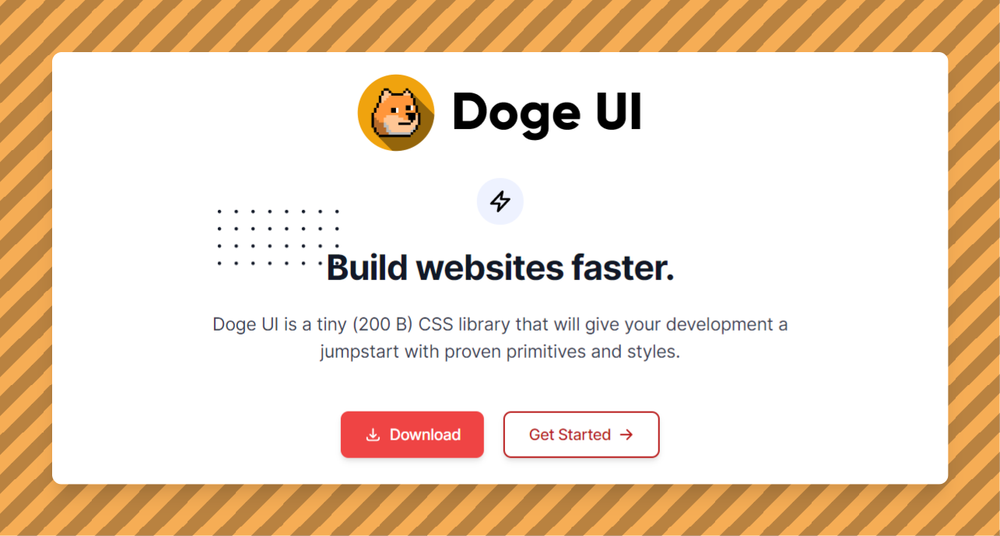

<h1 align="center">
   
  
   
  Doge UI
   
</h1>

<h4 align="center">Doge UI is a CSS Component library with just enough but necessary components such as cards, avatar, alerts and many more included..</h4>

  
  
  
 

